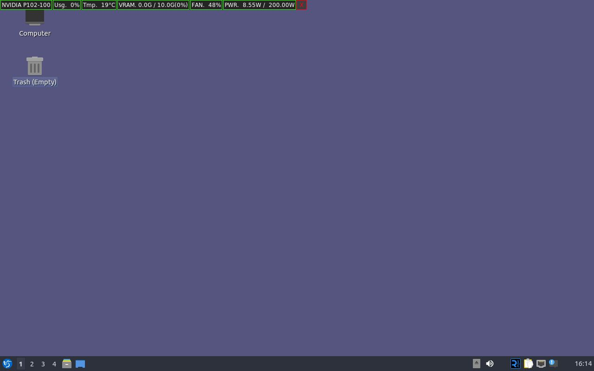

# About NVMon
---

This program is a small GUI tool that monitors the health of GPUs using NVIDIA-SMI in Linux.

It is written for Linux and Windows 10. but it may work with other OS.

The program based on Python and tkinter, and the icon was created using Stable Diffusion.

The items provide by this program are as follows.

|Item|Description|Unit|Example of output|
|---|---|---|---|
|Name|Name of GPU|String|NVIDIA P102-100|
|Usg|Usage of GPU|Percentage|98%|
|Tmp|Temperature of GPU|Degree|73°C|
|VRAM|States of GPU Memory|GigaByte and Percentage|9.4G / 10G(94%)|
|FAN|Duty of FAN|Percentage|82%|
|PWR|States of Power|Watt|210.00W / 250.00W|

# Features
---
- The window is always at the top.
- Use less display.

# How to install
---
1. The NVIDIA-SMI is required, so the NVIDIA driver must be installed. (NVIDIA-SMI is included in NVDIA driver)
2. Download executable file in [Release Page](https://github.com/kuper0201/NVMon/releases).
3. Unzip and execute the downloaded file.
4. Burn your GPU and enjoy it!
