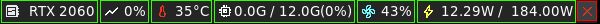
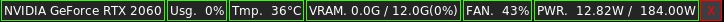

# NVMon

> A small GUI tool that monitors the health of GPUs using NVIDIA-SMI in Linux.

## Preview

<table>
    <tbody>
        <tr>
            <th>Icon ver</th>
            <th></th>
        </tr>
        <tr>
            <td>Text ver</td>
            <td></td>
        </tr>
    </tbody>
</table>

## Table of Units
|Item|Description|Unit|Example of output|
|---|---|---|---|
|Name|Name of GPU|String|NVIDIA P102-100|
|Usg|Usage of GPU|Percentage|98%|
|Tmp|Temperature of GPU|Degree|73°C|
|VRAM|States of GPU Memory|GigaByte and Percentage|9.4G / 10G(94%)|
|FAN|Duty of FAN|Percentage|82%|
|PWR|States of Power|Watt|210.00W / 250.00W|

## Features
- The window is always at the top
- Use less display
- Cross Platform(tested with Linux and Windows10)

## How to install
1. The NVIDIA-SMI is required, so the NVIDIA driver must be installed. (NVIDIA-SMI is included in NVDIA driver)
2. Download executable file in [Release Page](https://github.com/kuper0201/NVMon/releases).
3. Unzip and execute the downloaded file.
4. Burn your GPU and enjoy it!

## Change Log
- ver1.1 (2024/7/16)
    - Now display items with icons instead of text.
    
- ver1.0 (2024/1/5)
    - First Release

## To do
- Support multiple GPUs.
